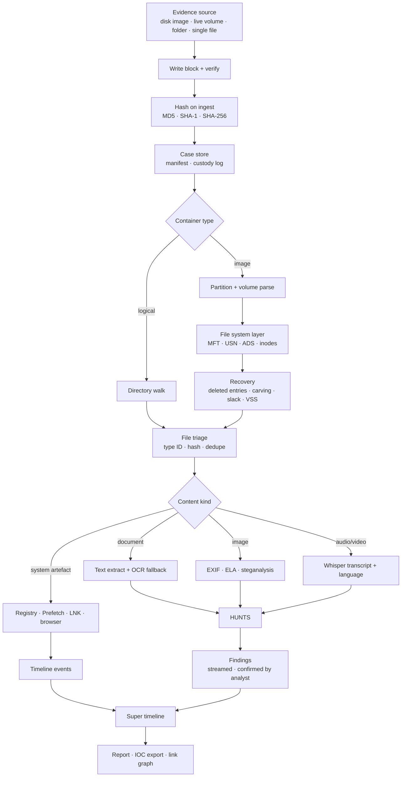

# Digital Forensics Workshop — build plan

Scoped 2026-09-10. Own repository, consumed by ATK as an **optional
submodule**, on the CyberWolf pattern.

## Status — Phases 1 and 2 built 2026-09-11

**Phase 1** — all six items of §8: the case store and custody log, hashing,
read-only enforcement and its AST ratchet, logical folder ingest with
signature type ID and dedupe, browser SQLite artefacts, and the ATK host page
through the airlock.

**Phase 2** — the file system layer (§5), the same day: RAW/DD and split
images; MBR (with the extended chain) and GPT, CRCs and the backup checked;
NTFS `$MFT` with fixups checked, attribute lists, sparse and fragmented runs
and ADS; deleted entries with their clusters measured against `$Bitmap` and
paths checked against parent sequence numbers; timestomp indicators
(`$STANDARD_INFORMATION` vs `$FILE_NAME`) as measurements with their benign
explanations; `$UsnJrnl:$J` (V2/V3/V4); file slack; signature carving of an
image, a volume, a gap or a volume's unallocated clusters, every result a
candidate with the basis of its length; preview that writes nothing and
recovery that records how the bytes were found. ATK gained **Disk Image** and
**Carving** pages. Engine 0.2.0; `python -m unittest discover -s tests`
(249 tests on a machine with ntfs-3g, sfdisk and sgdisk; the six real-tool
tests skip elsewhere).

`python -m forensics_workshop capabilities` lists what is built, what is not,
and which routes the licence rule excludes.

**Four decisions from Bill that change this plan as written:**

- **The package is `forensics_workshop`, not `forensics`** (§7). ATK already
  has `atk/core/forensics.py`, and the airlock decides "installed" by
  importing a name — a generic one can be answered by the wrong thing.
- **The licence is the same as ATK's: all rights reserved.** It is not
  Apache-2.0 like CyberWolf and the Writing Workshop. See `LICENSE`.
- **In ATK the workspace sits immediately after Image Analysis**, ninth in
  the rail.
- **Nothing that restricts commercial use** (§1.1, 2026-09-11). Third-party
  code must be under a permissive licence, and so must everything it pulls in.
  Every library this plan first named for E01, virtual disks, The Sleuth Kit,
  shadow copies, ESE, APFS and memory fails that: E01, virtual disks, shadow
  copies and ESE become native, and memory analysis is deferred.

**Built beyond the letter of the plan, because the spine needed it:** a
hash-chained custody log with an anchor kept outside the case (ATK's case
index), so a rewritten log is caught; WAL-aware browser parsing; before-and-
after timestamps on every read, so a last-access change is *measured*; cloud
placeholders recorded and not read; a command line, which is the engine's own
surface and the seed of its reachability guard; and — in Phase 2 — refusal of
container formats read as raw, naming of GPT entries altered in one copy of
the array, a digest of every run's rows in custody, and a cross-check of the
parsers against real ntfs-3g and util-linux output.

**Not yet proven:**

- **The ATK pages have not been built under real Qt.** No package index was
  reachable that day; the pages were driven through a stand-in for PySide6
  (87 checks, every handler of all eight pages), which proves the Python and
  not the Qt calls. Run `tests\test_dfw_pages_build.py` in ATK — it now also
  asks real Qt to draw a carved PNG thumbnail.
- **No volume written by Windows has been parsed.** The real-tool tests use
  NTFS written by ntfs-3g, which is real NTFS but not Windows' own; the first
  Windows image is the next test.
- **The change journal has only met synthetic records** laid out from the
  documented structures; ntfs-3g does not keep one.
- **Not built in Phase 2:** LZNT1 decompression (compressed streams are
  refused, not returned), FAT/exFAT directories (volumes are identified and
  can be carved), ext4, E01 and VHDX/VMDK (to be native, §1.1), Volume Shadow Copies (Phase 4),
  `$MFT`/`$J` files exported by collection tools such as KAPE, and a live
  physical-device reader.
- The USB `WriteProtect` policy and the write probe have not run on Windows.

---

## 0. The two decisions that shape everything else

### 0.1 It is a separate repo, and it goes through the airlock

ATK already has the pattern and has already been burned by getting it wrong:
CyberWolf reported *"not installed"* when it was installed, three times, because
a page constructor raised and the failure was rendered as a missing repo. The
rule that came out of it is absolute and this repo inherits it:

> **Past the line where the vendor package imported, no failure may be
> reported as a missing repo.**

So the ATK side is a thin host that (a) imports, (b) reports the *actual*
`Reported:` line on failure, and (c) calls `subsystem.forget()` on teardown. The
`_unavailable_page` says which of the three states it is in — not installed,
installed but failed to load, installed and loaded but a capability is missing —
because those need three different actions from the operator.

Consequence for this repo: **it must be usable and testable standing alone**,
with no ATK import anywhere in its core. ATK supplies the model, the panel and
the hunts; the forensics engine supplies evidence handling and knows nothing
about Qt.

### 0.2 Evidence does not live in the ATK folder

ATK's standing rule is that every result lives inside the ATK folder. **This
module is the deliberate exception**, and the reason should be written down
before someone "fixes" it: a case is the operator's, often on a different
volume, frequently larger than the application, and sometimes required to sit on
media that is handled under its own rules. A case folder is chosen per case and
remembered by path.

What ATK *does* keep is the **case index** — where cases are, when they were
opened, their hashes — so a case can be found again without the toolkit holding
the evidence.

---

## 1. The honest capability table

Bill's requirement is offline-first with no external APIs. That is achievable
for most of this list and **not** achievable for all of it without vendoring
third-party code, some of which carries licence terms ATK has already had to
refuse once (`pykakasi`, GPL-3.0, refused with `--no-deps`).

So before any build order, the honest breakdown. **Native** means ATK writes it
in Python against a documented format — the house style, and already proven
against the Midas BLUE layouts and the stdlib OSM PBF reader.

| capability | how | honesty note |
|---|---|---|
| Hashing MD5/SHA-1/SHA-256 | **native** (`hashlib`) | trivial, and the foundation |
| RAW/DD image reading | **native** | it is a byte stream |
| E01 / EWF reading | **native** (`zlib`) | the format is documented and its chunks are zlib-compressed. **pyewf (libewf) is LGPL-3.0 and fails the licence rule** |
| AFF4 | **native**, low priority | rare in practice. pyaff4 itself is Apache-2.0, but its dependency tree has not been checked, and the engine takes no dependencies |
| VHD/VHDX/VMDK | **native** | a fixed VHD is read already; the rest follow published specifications. **pyvhdi and pyvmdk (libyal) are LGPL-3.0 and fail the licence rule** — the "Apache-2.0-ish" this row once said was wrong |
| Partition tables (MBR/GPT) | **native** | documented, small |
| NTFS: `$MFT`, `$USNJrnl`, ADS | **native** | the formats are published and stable; this is exactly the kind of parser this project writes well |
| FAT/exFAT | **native** | small |
| Ext4 inodes, orphan recovery | **native**, non-trivial | superblock + inode tables are documented; extent trees are the work |
| APFS | **defer**; native when it comes | genuinely hard; **defer, and say so** rather than half-support it. pyfsapfs is LGPL-3.0 and fails the licence rule |
| Full TSK coverage | **excluded** | pytsk3's bindings are Apache-2.0, but they build in The Sleuth Kit, whose IPL/CPL terms are copyleft. File systems are added natively, one at a time |
| File carving by signature | **native** | a signature table plus a scanner; ATK should own this |
| Volume Shadow Copies | **native** | offline, from an image. **pyvshadow is LGPL-3.0 and fails the licence rule** |
| Registry hives | **native** | the hive format is well documented. `python-registry` is Apache-2.0 from 0.2.0 (GPL-3.0 before), but the engine takes no dependencies |
| Prefetch | **native** | Win10+ MAM compression needs `RtlDecompressBufferEx` — available on Windows through `ctypes`, no third party |
| LNK / Jump Lists | **native** | Shell Link + OLE compound file; documented |
| Amcache / Shimcache | **native** (they are registry/hive) | |
| Browser artefacts | **native** (`sqlite3` stdlib) | Chrome/Firefox/Edge are SQLite; this is the cheapest high-value win in the whole list |
| ESE databases (SRUM, Windows Search) | **native** | documented, and a real piece of work. **pyesedb is LGPL-3.0 and fails the licence rule** |
| EXIF / document metadata | **native** (PIL + existing `forensics.py`) | already partly built |
| Steganalysis (LSB, chi-square, RS) | **native** | `forensics.py` already does ELA and noise fingerprinting; this is an extension of work that exists |
| OCR | **existing `ocr.py`** | already in ATK |
| Audio transcription | **existing Whisper path** | already in ATK |
| Memory (RAM) analysis | **deferred** | **no route passes the licence rule**: Volatility 3 (its own copyleft licence) and MemProcFS (AGPL-3.0) both fail. Native, if it earns its place after Phase 4 — with its own symbol-table problem |
| Super timeline | **native** merge | the merge is easy; the parsers above are the work |
| Encrypted volume *detection* | **native** | signatures for BitLocker/LUKS/FileVault are identifiable |
| Encrypted volume *decryption* | **out of scope for v1** | key extraction from hibernation/memory is a real capability and a real rabbit hole; do not promise it in the same breath as detection |

**What this table is for**: so that a phase does not get planned around a
capability that turns out to need a package we cannot ship. Every "native" row
is a week of work and no licence risk. A third-party row is admissible only if
it passes §1.1 — and none of the ones this table first named does.

### 1.1 The licence rule — nothing that restricts commercial use

**Bill, 2026-09-11: nothing that will restrict commercial use.** Said at the
start, so that nothing is built on a library that has to be torn out later.
As applied to this repository:

- **Permissive licences only**, for anything the engine would import, bundle
  or require: MIT, BSD, Apache-2.0, ISC, PSF, zlib, CC0 and their kin. The list
  is `PERMISSIVE_LICENCES` in `forensics_workshop/capabilities.py`, and it is
  an allowlist: a licence nobody has checked is refused, not waved through.
- **Excluded: copyleft of every strength, and anything non-commercial** — GPL,
  AGPL, LGPL, MPL, EPL, the IBM and Common Public Licences, the Volatility
  Software License, PolyForm Noncommercial, CC BY-NC, and source-available
  terms.
- **LGPL is on the excluded side deliberately.** It does allow commercial use,
  but on conditions: the user must be able to replace the library, whoever
  ships it must offer its source, and LGPL-3.0 requires the product's terms to
  permit reverse engineering to debug such a replacement. A closed, all-rights-
  reserved product would carry those conditions for as long as it used the
  library. Keeping them out is cheaper than managing them.
- **The whole tree counts.** A permissive package that pulls in or builds in a
  copyleft one fails; pytsk3 is the example.
- **Formats are implemented from their documentation**, never by copying or
  translating code from an excluded project.
- **An examiner's own tools are not dependencies.** Converting an E01 to raw
  with FTK Imager or ewfexport before registering it is the examiner's step;
  nothing of those tools ships with the workshop or is needed by it.

What the rule changed:

| route this plan named | licence | now |
|---|---|---|
| pyewf (libewf) | LGPL-3.0-or-later | E01 native |
| pyvhdi, pyvmdk (libyal) | LGPL-3.0-or-later | VHDX, VMDK and dynamic VHD native |
| pytsk3 (The Sleuth Kit) | Apache-2.0 bindings over an IPL-1.0 / CPL-1.0 core | file systems native, one at a time |
| pyvshadow (libvshadow) | LGPL-3.0-or-later | Volume Shadow Copies native (Phase 4) |
| pyesedb (libesedb) | LGPL-3.0-or-later | ESE native (Phase 4) |
| pyfsapfs (libfsapfs) | LGPL-3.0-or-later | APFS still deferred; native when it comes |
| Volatility 3 | Volatility Software License 1.0 | memory analysis deferred |
| MemProcFS; Fox-IT's dissect.evidence | AGPL-3.0 | not used, and not a source to copy from |

Each library is an **excluded** row in the capability table with the licence
that fails, so the reason travels with the code and ATK's Capabilities page
shows it. `tests/test_capabilities_packaging.py` holds every other third-party
row to the allowlist, and the table shows a failing row as excluded even if
someone adds it as planned.

**Beyond this repository.** Phase 3 leans on ATK's own components — OCR,
Whisper, Pillow — and ATK has dependencies of its own under the same question:
PySide6, which draws every ATK page, is LGPL-3.0. That review belongs to ATK,
and Phase 3 should not build on a component until it has passed it.

---

## 2. The pipeline



Two things to notice about the shape.

**Everything converges on hunts.** A document, a photograph, a voice memo and a
registry key are four extractors feeding one question-answering layer. That is
why the hunt engine is being built shared (see ATK `FUTURE_PLANS.md` §H) — this
module is its third front door, and if it were built separately here there would
be three answers to "what is a finding".

**Preview before recovery.** Bill: *"With previews where possible before
recovery."* Every recovery path — a carved file, a deleted MFT entry, a shadow
copy — yields a **header, a size, a type guess and a thumbnail or first page**
before anything is written out. Carving a 40 GB unallocated region produces
thousands of candidates and most are fragments; recovering them all first and
looking after is how an analyst loses an afternoon.

---

## 3. Write blocking, and the part that must not be oversold

This is the capability where a toolkit can do real harm by being confident.

**A software write blocker on Windows is not a hardware write blocker.** What
can honestly be built:

1. **Read-only by construction.** Every handle this module opens on evidence is
   opened read-only, on every path, with no exceptions and an **AST ratchet
   asserting no `"w"`, `"a"`, `"r+"` or `os.O_WRONLY` reaches an evidence
   path.** This is the guarantee that is actually enforceable, and it is
   enforceable because it is structural rather than a promise.
2. **USB write protection via the documented registry policy**
   (`HKLM\SYSTEM\CurrentControlSet\Control\StorageDevicePolicies\WriteProtect`).
   Requires elevation; affects USB mass storage only; **does not cover
   Thunderbolt, internal buses, or anything already mounted.**
3. **Verification, which is the part that matters.** Set the policy, then
   *attempt a write and confirm it fails*, and report the result of the
   attempt. A setting that was applied is not the same claim as a device that
   refused a write. This module reports the second.
4. **Mount-state warnings.** If Windows has already mounted and journalled a
   volume, saying so plainly, because by then the evidence has already changed
   and no tool can undo it.

**What the UI must say, prominently and permanently**: for evidence that will be
presented anywhere it matters, use a hardware write blocker. This module's
protection is defence in depth, not a substitute. A forensics tool that implies
otherwise is worse than one with no write blocking at all, because it removes
the operator's reason to reach for the real thing.

---

## 4. Chain of custody

The case store is the spine, and the design rule is the one CyberWolf's actor
ledger arrived at: **the record is append-only and it never states a conclusion.**

```
<case>/
    case.json          identifier, examiner, opened, description
    custody.jsonl      append-only: every action, actor, timestamp, hashes
    evidence/          source images and their sidecars (read-only)
    extracted/         everything recovered, by source
    findings/          hunt findings + analyst decisions (the §H store)
    reports/
```

- **Hash on ingest, hash on export, and verify on demand.** The verify is a
  first-class button, not a setting — an examiner is asked *when* a hash was
  last confirmed, not whether hashing is enabled.
- **`custody.jsonl` is append-only and separately flushed and `fsync`ed.** Same
  reasoning as the GPS track: a log that only survives a clean shutdown does not
  survive the situations it exists for.
- **A recovered file records how it was recovered** — MFT entry, carved at
  offset, shadow copy N, slack space — because "recovered" spans claims of very
  different strength and a report that flattens them is misleading.
- **Nothing here says a file is a file.** A carved JPEG whose header parsed and
  whose tail is missing is a *candidate*, and it is labelled one all the way to
  the report.

---

## 5. Phases

### Phase 1 — the spine (build this before anything clever)

Ingestion, hashing, case store, custody log, read-only enforcement + its AST
ratchet, logical folder walk, file type identification by signature, dedupe by
hash, and the ATK host page through the airlock. **Plus browser SQLite
artefacts**, because they are stdlib, high value, and prove the whole spine
end to end on real data with no third-party dependency at all.

Deliverable: point it at a folder or a mounted volume, get a hashed, indexed,
custody-logged case with browser history in it.

### Phase 2 — the file system layer

RAW/DD and partition parsing, NTFS `$MFT` and `$USNJrnl`, ADS enumeration,
deleted-entry recovery, **signature carving with preview**, slack and
unallocated scraping, timestomp detection (`$FILE_NAME` vs
`$STANDARD_INFORMATION`). E01 and the virtual disk containers (VHDX, VMDK,
dynamic VHD) **natively** — the libraries that read them fail the licence rule
(§1.1) — and not built yet.

### Phase 3 — DOMEX and hunts

Text extraction + OCR fallback, EXIF and Office/PDF metadata, steganalysis
extending the existing `forensics.py`, Whisper on every audio and video file,
and the **hunt engine wired across all of them**. This is the phase Bill
described first and it is third on purpose: hunts over an unverified,
un-custodied corpus produce findings nobody can stand behind.

**Audio, per his note**: Whisper first, transcript into the hunt corpus, and
**the language tagged by task, not by detected language** — the subtitles path
already learned that one. A non-English source is noted on the finding, and the
transcript keeps both the original and the translation rather than replacing
one with the other.

### Phase 4 — system state and timeline

Registry hives, Prefetch, Amcache, Shimcache, LNK and Jump Lists, ESE
databases and Volume Shadow Copies (both native, §1.1), and the **super timeline** merging file system
timestamps, event logs, browser history and artefact events into one ordered
record. IOC export to CSV/JSON, and STIX **only if a consumer for it actually
exists** — an export format nobody reads is a week spent on nothing.

### Phase 5 — memory, and only if it earns its place

**Deferred: no route passes the licence rule** (§1.1). Volatility 3 and
MemProcFS are both copyleft, so process and thread extraction, injection
detection and network state reconstruction would be written natively — a large
body of work with its own symbol-table problem, and a different skill set.
Worth doing; not worth doing before phases 1–4 are solid.

**Explicitly out of scope for v1**: FDE key extraction and volume decryption,
APFS, and mobile device acquisition. Detection of all three, yes. Handling,
later, deliberately.

---

## 6. Where the LLM belongs — and where it does not

Bill: *"Consider comprehensively how visual analysis and document analysis using
LLMs can be leveraged."*

Comprehensively, and the boundary matters more than the list.

**Good uses — judgement over extracted facts:**

- **Hunts** across documents, images and transcripts. The core of it.
- **Triage ranking**: given 40,000 recovered files, which 200 should a human
  open first, and why — with the reason in the model's own sentences, which is
  already the rule the vision path enforces (`why` is the whole point; a bare
  label cannot be argued with).
- **Cross-artefact correlation proposals**: this LNK file, this browser
  download and this USB serial appear to describe one event. **Proposed**, then
  confirmed by the analyst, onto the link graph — the same man-in-the-middle
  design as the image hunts.
- **Timeline narration**: turning a 400,000-row super timeline into "here is
  what appears to have happened between 14:02 and 14:19", with every sentence
  citing the rows it came from.
- **Explaining an artefact** to an examiner who has not met it before. This is
  the Signals Analysis Assistant pattern, pointed at forensics.

**Where it must never go:**

- **It does not decide what a file is.** Type identification is signatures and
  magic numbers. A model's guess in that field would flow into the report as
  fact.
- **It does not touch hashes, timestamps or offsets.** Measured values, and the
  measured/authored boundary this project already enforces in the writing
  engine applies here with more force.
- **It does not write to `custody.jsonl`.** Ever.
- **Its output is always attributed and always dated with the model that
  produced it**, exactly as the online core stamps every remote answer.
- **A finding it produced is a finding, never a conclusion**, and the report
  says which of its sentences came from a model.

---

## 7. Repository shape

```
Digital-Forensics-Workshop/
    pyproject.toml
    README.md
    FORENSICS_PLAN.md          this file
    forensics_workshop/        (built as forensics_workshop — see Status)
        __init__.py            __version__, capability probe
        case.py                case store, custody log, manifest
        hashing.py
        blocker.py             read-only enforcement + USB policy + verify
        containers/            raw, ewf, vhd, partitions
        filesystems/           ntfs, fat, ext4
        recovery/              carve, slack, unallocated, vss
        artefacts/             registry, prefetch, lnk, browser, ese
        domex/                 metadata, stego, ocr bridge, transcript bridge
        timeline/              events, merge, export
        report/                markdown, docx, IOC export
    tests/                     runs standalone, no ATK, no Qt
    samples/                   synthetic images built by script, never real evidence
```

- **`samples/` are generated, never committed.** A build script writes a small
  NTFS image with known deleted files and known ADS. Committing real evidence to
  a repository is a mistake nobody undoes, and synthetic samples make the tests
  deterministic besides.
- **Tests import no ATK and construct no `QApplication`.** The suite must go
  green in a bare checkout, or the airlock cannot be tested at all.
- Public entry points enumerated and covered by a **reachability guard** — the
  same set-equality ratchet ATK uses, because a re-export is an offer, not a
  path, and this repo will accumulate engines faster than surfaces.

---

## 8. First session's work

1. `pyproject.toml`, package skeleton, version, capability probe.
2. `case.py` + `hashing.py` + `custody.jsonl` with `fsync`, and their tests.
3. `blocker.py` read-only enforcement and the AST ratchet — the guarantee that
   is actually enforceable, built before anything that could violate it.
4. Logical folder ingestion end to end: point it at a directory, get a hashed
   case with a custody log.
5. Browser SQLite artefacts, as the first real extractor.
6. The ATK host page through the airlock, reporting all three unavailable
   states correctly.

That is a standing, testable, honest tool with no third-party dependency and no
licence question — and every later phase plugs into it rather than reshaping it.
